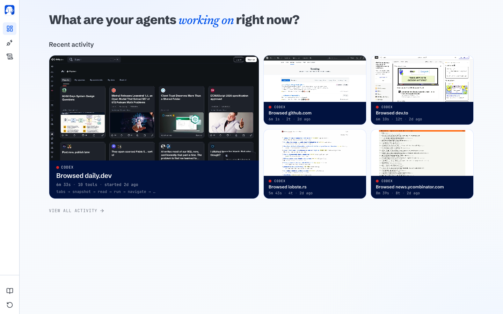
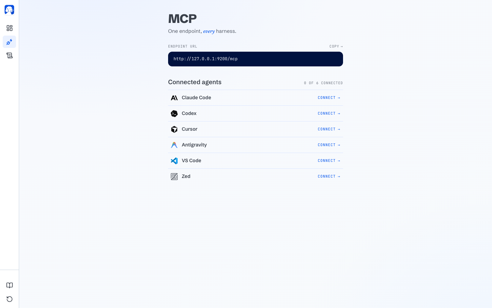
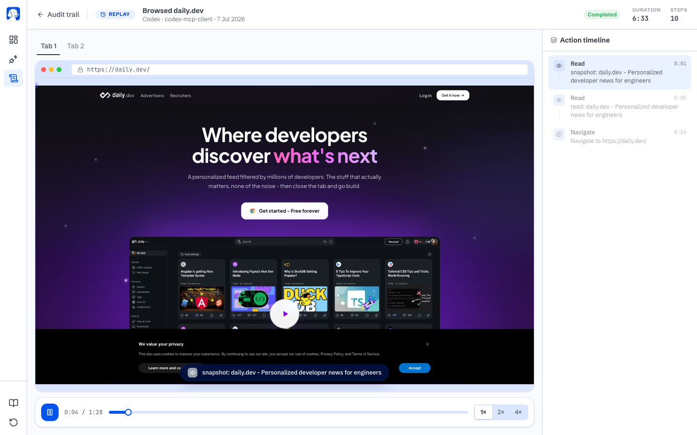

# Mahoraga

Adaptive web automation agent powered by [Browser Use](https://github.com/browser-use/browser-use).
Give it a task in plain English and it drives a real browser to complete it.

Mahoraga is a layered stack: an **n8n** workflow engine orchestrates tasks, the
**Mahoraga service** turns them into browser work, and a **BrowserOS kernel**
mediates every browser action down to Chrome / Edge / Firefox. You can use just
the CLI, or run the whole stack — see [docs/ARCHITECTURE.md](docs/ARCHITECTURE.md).

## Setup

Requires Python 3.11+.

```bash
# with uv (recommended)
uv venv && source .venv/bin/activate
uv pip install -e .

# or with pip
python -m venv .venv && source .venv/bin/activate
pip install -e .
```

Copy `.env.example` to `.env` and set at least one LLM API key (Anthropic,
OpenAI, Google, Browser Use cloud, Groq, or a local Ollama host).

## Usage

### CLI

```bash
mahoraga "Find the number of stars of the browser-use repo"

# pick a provider/model explicitly
mahoraga --provider anthropic --model claude-sonnet-5 "Compare prices for ..."

# watch the browser while it works
mahoraga --headed "Fill out the contact form on example.com"
```

The agent's final answer is printed to stdout, so it composes with shell
pipelines; progress logs go to stderr.

### The Wheel of Dharma — adaptive automation + console

Mahoraga incorporates n8n-style workflow automation natively as the **Wheel of
Dharma**: its memory of adaptations. The Wheel closes a loop —

```
recognize → (known?) replay a workflow  ·  (new?) improvise with the agent → crystallize
```

The first time Mahoraga solves a task it improvises (live agent). On success it
**crystallizes** the solve into a stored workflow. Next time it recognizes the
task and **replays** that workflow — deterministic, no LLM. It doesn't get hit
by the same thing twice.

Start the service and open the console at `http://localhost:8080/`:

```bash
mahoraga serve --host 0.0.0.0 --port 8080
```

The console is one cohesive surface: **Turn the Wheel** (run a task), the
**Workflow** canvas (an n8n-flavored node editor), and **Adaptations** (the
crystallized workflows). Workflow nodes: `navigate`, `extract`, `agent`,
`http`, `set`, `log`.

Service endpoints:

- `GET /health`
- `POST /v1/tasks` — one-shot browser task → `{ success, result, provider, model, kernel }`
- `POST /v1/wheel/run` — run through the Wheel → `{ path: replay|improvise, success, result, workflow_id, crystallized }`
- `GET/POST /v1/workflows`, `GET/DELETE /v1/workflows/{id}`, `POST /v1/workflows/{id}/run`

Set `MAHORAGA_API_KEY` to require an `X-API-Key` header on mutating endpoints.

### n8n workflow engine

The [`n8n-nodes-mahoraga`](integrations/n8n-nodes-mahoraga) community node adds a
**Mahoraga → Run Browser Task** step to n8n, so any workflow can dispatch an AI
browser task. The bundled [`docker-compose.yml`](docker-compose.yml) brings up
n8n + the service + a BrowserOS kernel together:

```bash
cd integrations/n8n-nodes-mahoraga && npm install && npm run build && cd -
export ANTHROPIC_API_KEY=...
docker compose up --build   # n8n at :5678, service at :8080
```

### BrowserOS kernel

Point Mahoraga at a running BrowserOS (or any CDP-speaking browser) and it
attaches over the DevTools Protocol instead of launching its own browser — the
kernel owns the browser lifecycle:

```bash
mahoraga --cdp-url http://localhost:9222 "Summarize my open tabs"
# or: export BROWSEROS_CDP_URL=http://localhost:9222
```

### Credential vault (autonomous login)

Save a site login once and Mahoraga logs in on its own — it won't stop to wait
for you.

```bash
mahoraga vault add github.com --username octocat   # prompts for the password
mahoraga vault list
mahoraga vault rm github.com
```

You can also manage credentials from the console's **Vault** panel, or the API
(`GET/POST /v1/vault`, `DELETE /v1/vault/{domain}`).

How it stays safe:

- Credentials are **encrypted at rest** (Fernet) with a key from
  `MAHORAGA_VAULT_KEY`, or an auto-generated `~/.mahoraga/vault.key` (chmod 600).
- The **LLM never sees passwords**. At run time they are passed to Browser Use
  as `sensitive_data` placeholders (`vault_username` / `vault_password`); only
  the browser fills the real value into the page.
- When credentials are injected, the browser is **locked to that site**
  (`allowed_domains`), so a prompt-injected page elsewhere can't exfiltrate them.
- Passwords are never returned by the API/console list, and never logged.

For production, set `MAHORAGA_VAULT_KEY` from your OS keychain or a secrets
manager rather than relying on the generated key file.

### Python API

```python
from mahoraga import Settings, run_task

result = run_task(
    "Find the top 3 trending Python repos on GitHub and list their names",
    Settings(provider="anthropic", max_steps=30),
)
print(result)
```

## Configuration

Every setting is an environment variable (loadable from `.env`) with a
matching CLI flag:

| Env var | CLI flag | Default | Meaning |
| --- | --- | --- | --- |
| `MAHORAGA_LLM_PROVIDER` | `--provider` | auto-detected from API keys | `anthropic`, `openai`, `google`, `browser-use`, `groq`, `ollama` |
| `MAHORAGA_MODEL` | `--model` | per-provider default | Model name |
| `MAHORAGA_HEADLESS` | `--headed` (inverts) | `true` | Run Chromium without a window |
| `MAHORAGA_MAX_STEPS` | `--max-steps` | `50` | Step budget per task |
| `MAHORAGA_USE_VISION` | `--no-vision` (inverts) | `true` | Send screenshots to the LLM |
| `MAHORAGA_CHROMIUM_PATH` | `--chromium-path` | auto-detected | Chromium/Chrome binary to use |
| `BROWSEROS_CDP_URL` / `MAHORAGA_CDP_URL` | `--cdp-url` | none (launch local) | Attach to a BrowserOS kernel over CDP |
| `MAHORAGA_API_KEY` | — | none | Require `X-API-Key` on the HTTP service |
| `MAHORAGA_WHEEL_DIR` | — | `~/.mahoraga/wheel` | Where crystallized workflows are stored |
| `MAHORAGA_VAULT_KEY` | — | generated key file | Fernet key encrypting saved site logins |
| `MAHORAGA_VAULT_FILE` | — | `~/.mahoraga/vault.enc` | Encrypted credential vault location |

If a system Chromium is found (e.g. a Playwright install or `/usr/bin/chromium`),
Mahoraga uses it instead of letting Browser Use download its own copy — handy in
containers and CI.
<div align="center">


<br></br>
<a href="https://discord.gg/YKwjt5vuKr"></a>
<a href="https://dub.sh/mahoraga-slack"></a>
<a href="https://x.com/mahoraga_ai"></a>
<a href="https://github.com/connectserverlab-del/mahoraga"></a>
<br></br>

</div>

<table>
<tr>
<td width="50%" align="center" valign="top">


### BrowserClaw

**The browser for AI agents**

Claude Code, Codex, Cursor, or any MCP client drives it using the accounts you're already signed into, while you watch live and replay every step.

[](https://cdn.mahoraga.com/download/BrowserClaw.dmg)
[](https://cdn.mahoraga.com/download/BrowserClaw_installer.exe)

**[Website](https://www.mahoraga.com/agents)** · **[Docs](https://docs.mahoraga.com/browserclaw)**

</td>
<td width="50%" align="center" valign="top">


### Mahoraga

**The AI browser for humans**

An open-source Chromium fork with a built-in AI agent, the privacy-first alternative to ChatGPT Atlas, Perplexity Comet, and Dia.

[](https://files.mahoraga.com/download/Mahoraga.dmg)
[](https://files.mahoraga.com/download/Mahoraga_installer.exe)
[](https://files.mahoraga.com/download/Mahoraga.AppImage)
[](https://cdn.mahoraga.com/download/Mahoraga.deb)

**[Website](https://www.mahoraga.com)** · **[Docs](https://docs.mahoraga.com)**

</td>
</tr>
</table>

<div align="center">

**Two browsers, one codebase.** Free · Open source (AGPL-3.0) · Local-only · Bring your own AI keys

</div>

## BrowserClaw

**What is BrowserClaw?** BrowserClaw is a free, open-source browser your AI agents drive using your logged-in accounts. You install it like any browser, sign into the sites you use, and give tasks to Claude Code, Codex, Cursor, or any MCP-compatible AI. Your agents work in their own tabs while you watch every step live and replay any session like a video.

Your AI is smart, but it can't press the buttons. Ask it to book a flight, download an invoice, or reply to an email, and it stops at the login screen. BrowserClaw fixes that.

### Get started

1. **Install BrowserClaw and sign in** to the sites you use every day. It works like any browser, and every account you sign into becomes something your AI can use.
2. **Connect your AI in one click.** Claude Code, Codex, Cursor, VS Code, Zed, OpenCode, and Antigravity install with a single click; anything else that speaks MCP connects with a URL.
3. **Give it a real task.** In your AI chat: *"Find a good time next week for a 30-minute team meeting and send the invite."* Then watch it live from your new tab and replay the whole run like a video.

### Key features

<table>
<tr>
<td width="40%" valign="middle">
<h4>Live dashboard</h4>
Your new tab shows every agent working right now: which site it's on, what it's doing, how far along. <a href="https://docs.mahoraga.com/browserclaw/cockpit">Docs</a>
</td>
<td width="60%">

</td>
</tr>
<tr>
<td width="40%" valign="middle">
<h4>One-click MCP connect</h4>
One endpoint, every harness. Seven AI tools set up with a single click. <a href="https://docs.mahoraga.com/browserclaw/mcp">Docs</a>
</td>
<td width="60%">

</td>
</tr>
<tr>
<td width="40%" valign="middle">
<h4>Replay every session</h4>
Every session is saved as a scrubbable video on your disk with a step-by-step action timeline. Rewind and see exactly what happened. <a href="https://docs.mahoraga.com/browserclaw/audit-and-replay">Docs</a>
</td>
<td width="60%">

</td>
</tr>
</table>

- **Your logins.** Agents automate your real work using the sessions you already have, not a blank sandbox. [How it works](https://docs.mahoraga.com/browserclaw/how-it-works)
- **Local-only.** Sessions, screenshots, and history live under `~/.browserclaw/` and never leave your machine. [Privacy](https://docs.mahoraga.com/browserclaw/privacy)

### Why BrowserClaw over the alternatives?

- **Not a headless driver.** Playwright and browser-use spin up a fresh Chrome subprocess with no logins. Great for CI, useless for "book my flight" or "read my inbox." BrowserClaw is the browser your logins already live in.
- **Not a cloud browser.** Browserbase and Browser Use Cloud run your agent's session on someone else's infrastructure. Your prompts and session tokens pass through their servers. BrowserClaw runs on your machine, on `127.0.0.1`.

## Mahoraga

**What is Mahoraga?** Mahoraga is a free, open-source Chromium fork with an AI agent built into every new tab. Ask it to summarise a page, click through a flow, extract data, or run a scheduled task, and it uses 53+ built-in browser tools plus 40+ app integrations to get the work done. Bring your own AI keys or run everything locally with Ollama.

Every AI browser today asks you to sign into their cloud and hand over your data. Mahoraga is the one that doesn't. Same daily browser you already use, with a helpful agent one keystroke away.

### Get started

1. **Download and install** Mahoraga: [macOS](https://files.mahoraga.com/download/Mahoraga.dmg) · [Windows](https://files.mahoraga.com/download/Mahoraga_installer.exe) · [Linux (AppImage)](https://files.mahoraga.com/download/Mahoraga.AppImage) · [Linux (Debian)](https://cdn.mahoraga.com/download/Mahoraga.deb).
2. **Import from Chrome** in one click. Bookmarks, passwords, extensions all carry over.
3. **Connect your AI provider.** Claude, OpenAI, Gemini, ChatGPT Pro via OAuth, or local models via Ollama or LM Studio.

### Key features

<table>
<tr>
<td width="40%" valign="middle">
<h4>Mahoraga agent in action</h4>
Ask it in plain English. 53+ browser tools plus 40+ app integrations (Gmail, Slack, GitHub, Linear, Notion, and more). <a href="https://docs.mahoraga.com/getting-started">Docs</a>
</td>
<td width="60%">
<a href="https://www.youtube.com/watch?v=SoSFev5R5dI"></a>
</td>
</tr>
<tr>
<td width="40%" valign="middle">
<h4>Install as MCP and control from claude-code</h4>
Turn Mahoraga into an MCP server and drive it from Claude Code, Cursor, or any MCP client. <a href="https://docs.mahoraga.com/features/use-with-claude-code">Docs</a>
</td>
<td width="60%">
<video src="https://github.com/user-attachments/assets/c725d6df-1a0d-40eb-a125-ea009bf664dc" controls width="100%"></video>
</td>
</tr>
<tr>
<td width="40%" valign="middle">
<h4>Use Mahoraga to chat</h4>
Chat about the current page from the side panel. Summarise, ask questions, transform what you're reading. <a href="https://docs.mahoraga.com/getting-started">Docs</a>
</td>
<td width="60%">
<video src="https://github.com/user-attachments/assets/726803c5-8e36-420e-8694-c63a2607beca" controls width="100%"></video>
</td>
</tr>
<tr>
<td width="40%" valign="middle">
<h4>Use Mahoraga to scrape data</h4>
Point the agent at a page, tell it what to pull, and get structured data back. <a href="https://docs.mahoraga.com/getting-started">Docs</a>
</td>
<td width="60%">
<video src="https://github.com/user-attachments/assets/9f038216-bc24-4555-abf1-af2adcb7ebc0" controls width="100%"></video>
</td>
</tr>
</table>

- **Cowork with files.** Combine browser automation with local file operations in one session. [Docs](https://docs.mahoraga.com/features/cowork)
- **Scheduled tasks.** Run agents on autopilot: daily, hourly, or every few minutes. [Docs](https://docs.mahoraga.com/features/scheduled-tasks)
- **Bring your own AI.** 11+ providers, or fully local with Ollama and LM Studio. [Provider list](https://docs.mahoraga.com/features/bring-your-own-llm)
- **Real ad blocking.** uBlock Origin with full Manifest V2 support. [Docs](https://docs.mahoraga.com/features/ad-blocking)

### Run with Docker

Run the whole stack — streamed browser plus the Mahoraga agent server — with one command:

```bash
./selfhost/build-extension.sh          # stage the agent extension
echo "MAHORAGA_PASSWORD=change-me" > .env
docker compose up -d --build
```

The browser UI streams at `https://<host>:3001` and the agent server's MCP endpoint
listens on port `9100`. The server container shares the browser container's network
namespace, so it drives the browser over CDP on `localhost:9000` just like a local
install. See [`docker-compose.yml`](docker-compose.yml) and
[`docker/server.Dockerfile`](docker/server.Dockerfile).

### Use it from your phone

Run Mahoraga on a server and stream it to your phone's browser — see the
[self-host guide](selfhost/README.md) for a Docker Compose stack with Tailscale-secured
remote access.

### Roadmap ideas

Mahoraga is named after the wheel that adapts to anything — see [SUGGESTED_FEATURES.md](SUGGESTED_FEATURES.md) for proposed features (adaptive site memory, multi-tab agent orchestration, prompt-to-workflow builder, and more).

### Why Mahoraga over the alternatives?

- **Not Chrome with an AI extension.** Extensions can't touch the browser chrome, can't run scheduled background tasks, can't ship 53+ browser tools that the agent uses natively. Mahoraga builds the agent into Chromium itself.
- **Not Comet, Atlas, or Dia.** Those AI browsers route your prompts through their cloud with their model. Mahoraga runs on your machine with your AI keys. Your data stays yours.

## LLM support

Bring your own keys, use OAuth for your existing subscriptions, or run models locally. The 6 most-used providers, at a glance:

| Provider | Type | Auth |
|---|---|---|
| Kimi (default) | Cloud | Built-in |
| Claude (Anthropic) | Cloud | API key |
| GPT-4o / o3 (OpenAI) | Cloud | API key |
| ChatGPT Pro/Plus | Cloud | OAuth |
| Ollama | Local | [Setup](https://docs.mahoraga.com/features/local-models) |
| LM Studio | Local | [Setup](https://docs.mahoraga.com/features/local-models) |

Full list of 11+ providers (Gemini, GitHub Copilot, Azure, Bedrock, OpenRouter, and more) is in the [bring-your-own-LLM docs](https://docs.mahoraga.com/features/bring-your-own-llm).

## How Mahoraga compares

| | Mahoraga | Chrome | Brave | Dia | Comet | Atlas |
|---|:---:|:---:|:---:|:---:|:---:|:---:|
| Open Source | ✅ | ❌ | ✅ | ❌ | ❌ | ❌ |
| AI Agent | ✅ | ❌ | ❌ | ❌ | ✅ | ✅ |
| MCP Server | ✅ | ❌ | ❌ | ❌ | ❌ | ❌ |
| Cowork (files + browser) | ✅ | ❌ | ❌ | ❌ | ❌ | ❌ |
| Scheduled Tasks | ✅ | ❌ | ❌ | ❌ | ❌ | ❌ |
| Bring Your Own Keys | ✅ | ❌ | ✅ | ❌ | ❌ | ❌ |
| Local Models (Ollama) | ✅ | ❌ | ✅ | ❌ | ❌ | ❌ |
| Local-first Privacy | ✅ | ❌ | ✅ | ❌ | ❌ | ❌ |
| Ad Blocking (MV2) | ✅ | ❌ | ✅ | ❌ | ✅ | ❌ |

**Detailed comparisons:**
- [Mahoraga vs Chrome DevTools MCP](https://docs.mahoraga.com/comparisons/chrome-devtools-mcp): developer-focused comparison for browser automation
- [Mahoraga vs Claude Cowork](https://docs.mahoraga.com/comparisons/claude-cowork): getting real work done with AI
- [Mahoraga vs OpenClaw](https://docs.mahoraga.com/comparisons/openclaw): everyday AI assistance

A dedicated BrowserClaw comparison table is coming; for now, see the [why BrowserClaw](#browserclaw) callouts above.

## FAQ

### General

**What's the difference between BrowserClaw and Mahoraga?**
BrowserClaw is a browser your AI drives; Mahoraga is a browser you drive, with an AI agent built in. Both ship from this repo and run side by side. Many people use Mahoraga as their daily browser and BrowserClaw as their agents' browser.

**Is either free? Is either open source?**
Both are free and open source under AGPL-3.0. Bring your own AI keys or run local models.

### BrowserClaw

**Which AI tools work with BrowserClaw?**
Any AI that speaks MCP. Claude Code, Codex, Cursor, VS Code, Zed, OpenCode, and Antigravity connect with one click; Claude Desktop connects via a [drop-in extension](https://docs.mahoraga.com/browserclaw/mcp/claude-desktop); anything else connects with a URL.

**Does my AI share my logins?**
Yes, and that's the point. Agents drive BrowserClaw using the sessions you already have, so they automate your real work instead of poking a blank sandbox. Every agent's tabs sit in their own colored Chrome tab group so you can always see whose is whose.

**Does anything leave my machine?**
Your sessions, screenshots, history, and settings live under `~/.browserclaw/` and never upload. BrowserClaw sends anonymous product-usage events (agent connect/disconnect, version, OS) to help us improve the app; it never sends URLs, page content, prompts, tool results, or screenshots. Off with one toggle in Settings. [Full policy](https://docs.mahoraga.com/browserclaw/privacy).

### Mahoraga

**What LLM providers does Mahoraga support?**
11+ providers: Kimi, Claude, OpenAI, Gemini, ChatGPT Pro/Plus and GitHub Copilot via OAuth, OpenRouter, Azure, Bedrock, or fully local through Ollama and LM Studio.

**Do my Chrome extensions and bookmarks work?**
Yes. Both browsers are Chromium forks, so Chrome extensions work and your bookmarks, passwords, and settings import in one click.

**What platforms are supported?**
BrowserClaw runs on macOS and Windows. Mahoraga runs on macOS, Windows, and Linux. System requirements match Google Chrome.

## Get help

- [Discord](https://discord.gg/YKwjt5vuKr) · [Slack](https://dub.sh/mahoraga-slack)
- [Report a bug](https://github.com/connectserverlab-del/mahoraga/issues)
- [BrowserClaw docs](https://docs.mahoraga.com/browserclaw) · [Mahoraga docs](https://docs.mahoraga.com)

## Architecture

Both products ship from this monorepo. Two main subsystems: the **browser** (Chromium fork) and the **agent platform** (TypeScript/Go).

```
Mahoraga/
├── packages/mahoraga/              # Chromium fork + build system (Python)
│   ├── chromium_patches/            # Patches applied to Chromium source
│   ├── build/                       # Build CLI and modules
│   └── resources/                   # Icons, entitlements, signing
│
├── packages/mahoraga-agent/        # Agent platform (TypeScript/Go)
│   ├── apps/
│   │   ├── claw-server/             # BrowserClaw backend: MCP endpoint + JSON API (Hono)
│   │   ├── claw-app/                # BrowserClaw dashboard extension (WXT + React)
│   │   ├── claw-onboard/            # BrowserClaw onboarding flow
│   │   ├── server/                  # Mahoraga MCP server + AI agent loop (Bun)
│   │   ├── app/                     # Mahoraga extension UI (WXT + React)
│   │   └── cli/                     # CLI tool (Go)
│   │
│   └── packages/
│       ├── agent-sdk/               # Node.js SDK (npm: @mahoraga-ai/agent-sdk)
│       ├── cdp-protocol/            # CDP type bindings
│       └── shared/                  # Shared constants
```

| Package | What it does |
|---------|-------------|
| [`packages/mahoraga`](packages/mahoraga/) | Chromium fork: patches, build system, signing |
| [`apps/claw-server`](packages/mahoraga-agent/apps/claw-server/) | BrowserClaw backend: MCP endpoint agents connect to, plus the API behind the dashboard |
| [`apps/claw-app`](packages/mahoraga-agent/apps/claw-app/) | BrowserClaw new-tab dashboard: watch, replay, and manage agent sessions |
| [`apps/server`](packages/mahoraga-agent/apps/server/) | Bun server exposing 53+ MCP tools and running the Mahoraga AI agent loop |
| [`apps/app`](packages/mahoraga-agent/apps/app/) | Mahoraga extension: new tab, side panel chat, onboarding, settings |
| [`apps/cli`](packages/mahoraga-agent/apps/cli/) | Go CLI: control Mahoraga from the terminal or AI coding agents |
| [`agent-sdk`](packages/mahoraga-agent/packages/agent-sdk/) | Node.js SDK for browser automation with natural language |
| [`cdp-protocol`](packages/mahoraga-agent/packages/cdp-protocol/) | Type-safe Chrome DevTools Protocol bindings |

## Contributing

We'd love your help making Mahoraga and BrowserClaw better. See the [Contributing Guide](CONTRIBUTING.md) for details.

- **Agent development** (TypeScript/Go): see the [agent monorepo README](packages/mahoraga-agent/README.md) for setup.
- **Browser development** (C++/Python): requires ~100GB disk space. See [`packages/mahoraga`](packages/mahoraga/) for build instructions.

## Credits

- [ungoogled-chromium](https://github.com/ungoogled-software/ungoogled-chromium): we use some of its patches for enhanced privacy. Thanks to everyone behind this project.
- [The Chromium Project](https://www.chromium.org/): at the core of both browsers, making it possible for them to exist in the first place.

## Citation

If you use Mahoraga or BrowserClaw in your research or project, please cite:

```bibtex
@software{mahoraga2025,
  author = {Nithin Sonti and Nikhil Sonti and {Mahoraga-team}},
  title = {Mahoraga: The open-source Agentic browser},
  url = {https://github.com/connectserverlab-del/mahoraga},
  year = {2025},
  publisher = {GitHub},
  license = {AGPL-3.0},
}
```

## License

Mahoraga and BrowserClaw are open source under the [AGPL-3.0 license](LICENSE).

Copyright &copy; 2026 Felafax, Inc.

## Stargazers

Thank you to all our supporters.

Team: Nikhil ([@nv_sonti](https://x.com/intent/user?screen_name=nv_sonti)), Nithin ([@ThatNithin](https://x.com/intent/user?screen_name=ThatNithin)) and Dani ([@dani_akash_](https://x.com/intent/user?screen_name=dani_akash_)):

[](https://x.com/intent/user?screen_name=nv_sonti)
&emsp;&emsp;&emsp;
[](https://x.com/intent/user?screen_name=ThatNithin)
&emsp;&emsp;&emsp;
[](https://x.com/intent/user?screen_name=dani_akash_)

<p align="center">
Built with ❤️ from San Francisco
</p>
