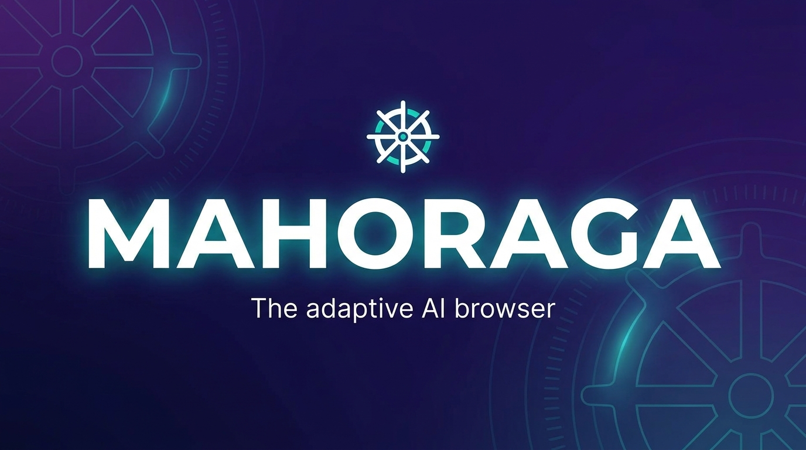

<div align="center">


<br></br>
<a href="https://discord.gg/YKwjt5vuKr"></a>
<a href="https://dub.sh/mahoraga-slack"></a>
<a href="https://x.com/mahoraga_ai"></a>
<a href="https://github.com/connectserverlab-del/mahoraga"></a>
<br></br>

**One product: workflows, agent, and browser — wired end to end.**

</div>

# Mahoraga

Mahoraga is an adaptive web automation product. Give it a task in plain English and
it drives a real browser to complete it — and everything it learns, it keeps.

It is **one integrated stack**, not three separate tools:

```
n8n (Workflow Engine)  ──HTTP──▶  Mahoraga service  ──Browser Use──▶  BrowserOS kernel (CDP)  ──▶  the web
```

| Layer | What it does | Where |
|---|---|---|
| **Workflow engine** | Bundled n8n with a native **Mahoraga node** — schedule, chain, and orchestrate browser tasks visually | `http://<host>:5678` |
| **Mahoraga service** | The agent: runs tasks, crystallizes successful solves into replayable workflows (the Wheel of Dharma), holds the credential vault, serves the console | `http://<host>:8080` |
| **BrowserOS kernel** | The browser layer every action flows through, spoken to over the DevTools Protocol | internal (`:9222`) |

## Run the whole product

```bash
cd integrations/n8n-nodes-mahoraga && npm install && npm run build && cd -
cp .env.example .env      # set at least one LLM API key
docker compose up -d --build
```

That's it. Open:

- **`http://localhost:5678`** — the automation studio (n8n) with the **Mahoraga → Run
  Browser Task** node available in every workflow
- **`http://localhost:8080`** — the Mahoraga console: run tasks, inspect the Wheel's
  crystallized workflows, manage the vault
- A starter workflow lives in [`docker/n8n/workflows/`](docker/n8n/workflows/)
  (mounted into n8n at `/workflows` — import via **Workflows → Import from file**)

The compose file wires the layers automatically: n8n calls the service at
`http://mahoraga:8080`, and the service drives the kernel at `http://browseros:9222`.
Set `MAHORAGA_API_KEY` in `.env` to require an `X-API-Key` on mutating endpoints
(the n8n credential must then match).

## Local install (service only)

Requires Python 3.11+.

```bash
uv venv && source .venv/bin/activate && uv pip install -e .
# or: python -m venv .venv && source .venv/bin/activate && pip install -e .
```

Copy `.env.example` to `.env` and set at least one LLM API key (Anthropic, OpenAI,
Google, Browser Use cloud, Groq, or a local Ollama host).

### CLI

```bash
mahoraga "Find the number of stars of the browser-use repo"

# pick a provider/model explicitly
mahoraga --provider anthropic --model claude-sonnet-5 "Compare prices for ..."

# watch the browser while it works
mahoraga --headed "Fill out the contact form on example.com"
```

The agent's final answer is printed to stdout, so it composes with shell pipelines;
progress logs go to stderr.

## The Wheel of Dharma — adaptive automation

Mahoraga is named after the wheel that adapts to anything. The Wheel closes a loop:

```
recognize → (known?) replay a workflow  ·  (new?) improvise with the agent → crystallize
```

The first time Mahoraga solves a task it improvises (live agent). On success it
**crystallizes** the solve into a stored workflow. Next time it recognizes the task and
**replays** that workflow — deterministic, no LLM. It doesn't get hit by the same thing
twice.

Start the service and open the console at `http://localhost:8080/`:

```bash
mahoraga serve --host 0.0.0.0 --port 8080
```

The console is one cohesive surface: **Turn the Wheel** (run a task), the **Workflow**
canvas (an n8n-flavored node editor), and **Adaptations** (the crystallized workflows).
Workflow nodes: `navigate`, `extract`, `agent`, `http`, `set`, `log`.

Service endpoints:

- `GET /health`
- `POST /v1/tasks` — one-shot browser task → `{ success, result, provider, model, kernel }`
- `POST /v1/wheel/run` — run through the Wheel → `{ path: replay|improvise, success, result, workflow_id, crystallized }`
- `GET/POST /v1/workflows`, `GET/DELETE /v1/workflows/{id}`, `POST /v1/workflows/{id}/run`

## The workflow engine (n8n)

The [`n8n-nodes-mahoraga`](integrations/n8n-nodes-mahoraga) community node adds a
**Mahoraga → Run Browser Task** step to n8n, so any workflow can dispatch an AI browser
task and use the result downstream — Slack alerts, spreadsheets, email, any of n8n's
integrations. Combined with the Wheel, this covers scheduled autonomous runs and page
watchers from [SUGGESTED_FEATURES.md](SUGGESTED_FEATURES.md) out of the box.

n8n ships inside the bundled compose stack (see [Run the whole product](#run-the-whole-product));
nothing to install separately. n8n is [fair-code](https://docs.n8n.io/reference/license/)
licensed and free for self-hosted use.

## The BrowserOS kernel

Every browser action flows through a CDP-speaking kernel. The bundled stack runs a
headless Chromium placeholder so it works out of the box; point Mahoraga at a running
[BrowserOS](packages/mahoraga/) build (the Chromium fork maintained in this repo under
`packages/`) to use the real kernel:

```bash
mahoraga --cdp-url http://localhost:9222 "Summarize my open tabs"
# or: export BROWSEROS_CDP_URL=http://localhost:9222
```

The fork adds an embedded agent extension, MCP tooling, and privacy patches
(with credits to [ungoogled-chromium](https://github.com/ungoogled-software/ungoogled-chromium)
and [The Chromium Project](https://www.chromium.org/)). Building it requires ~100GB of
disk — see [`packages/mahoraga`](packages/mahoraga/). Prefer using it from a phone or
thin client? See the [self-host guide](selfhost/README.md) for a streamed-browser setup.

## Credential vault (autonomous login)

Save a site login once and Mahoraga logs in on its own — it won't stop to wait for you.

```bash
mahoraga vault add github.com --username octocat   # prompts for the password
mahoraga vault list
mahoraga vault rm github.com
```

You can also manage credentials from the console's **Vault** panel, or the API
(`GET/POST /v1/vault`, `DELETE /v1/vault/{domain}`).

How it stays safe:

- Credentials are **encrypted at rest** (Fernet) with a key from `MAHORAGA_VAULT_KEY`,
  or an auto-generated `~/.mahoraga/vault.key` (chmod 600).
- The **LLM never sees passwords**. At run time they are passed to Browser Use as
  `sensitive_data` placeholders; only the browser fills the real value into the page.
- When credentials are injected, the browser is **locked to that site**
  (`allowed_domains`), so a prompt-injected page elsewhere can't exfiltrate them.
- Passwords are never returned by the API/console list, and never logged.

For production, set `MAHORAGA_VAULT_KEY` from your OS keychain or a secrets manager
rather than relying on the generated key file.

## Python API

```python
from mahoraga import Settings, run_task

result = run_task(
    "Find the top 3 trending Python repos on GitHub and list their names",
    Settings(provider="anthropic", max_steps=30),
)
print(result)
```

## Configuration

Every setting is an environment variable (loadable from `.env`) with a matching CLI flag:

| Env var | CLI flag | Default | Meaning |
| --- | --- | --- | --- |
| `MAHORAGA_LLM_PROVIDER` | `--provider` | auto-detected from API keys | `anthropic`, `openai`, `google`, `browser-use`, `groq`, `ollama` |
| `MAHORAGA_MODEL` | `--model` | per-provider default | Model name |
| `MAHORAGA_HEADLESS` | `--headed` (inverts) | `true` | Run Chromium without a window |
| `MAHORAGA_MAX_STEPS` | `--max-steps` | `50` | Step budget per task |
| `MAHORAGA_USE_VISION` | `--no-vision` (inverts) | `true` | Send screenshots to the LLM |
| `MAHORAGA_CHROMIUM_PATH` | `--chromium-path` | auto-detected | Chromium/Chrome binary to use |
| `BROWSEROS_CDP_URL` / `MAHORAGA_CDP_URL` | `--cdp-url` | none (launch local) | Attach to a BrowserOS kernel over CDP |
| `MAHORAGA_API_KEY` | — | none | Require `X-API-Key` on the HTTP service |
| `MAHORAGA_WHEEL_DIR` | — | `~/.mahoraga/wheel` | Where crystallized workflows are stored |
| `MAHORAGA_VAULT_KEY` | — | generated key file | Fernet key encrypting saved site logins |
| `MAHORAGA_VAULT_FILE` | — | `~/.mahoraga/vault.enc` | Encrypted credential vault location |

If a system Chromium is found (e.g. a Playwright install or `/usr/bin/chromium`),
Mahoraga uses it instead of letting Browser Use download its own copy — handy in
containers and CI.

## Roadmap

See [SUGGESTED_FEATURES.md](SUGGESTED_FEATURES.md): adaptive site memory, multi-tab
agent orchestration, per-site agent permissions, page watchers, and more.

## Get help

- [Discord](https://discord.gg/YKwjt5vuKr) · [Slack](https://dub.sh/mahoraga-slack)
- [Report a bug](https://github.com/connectserverlab-del/mahoraga/issues)

## Contributing

We'd love your help making Mahoraga better. See the [Contributing Guide](CONTRIBUTING.md).

- **Service / automation** (Python, TypeScript): the `mahoraga/` package and
  [`integrations/n8n-nodes-mahoraga`](integrations/n8n-nodes-mahoraga).
- **Agent platform** (TypeScript/Go): see the
  [agent monorepo README](packages/mahoraga-agent/README.md).
- **Browser kernel** (C++/Python): requires ~100GB disk space — see
  [`packages/mahoraga`](packages/mahoraga/).

## License

Mahoraga is open source under the [AGPL-3.0 license](LICENSE).
